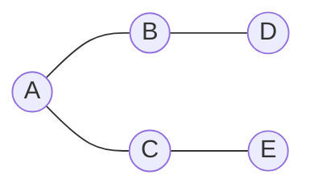
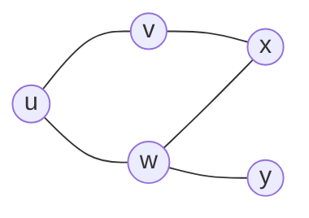
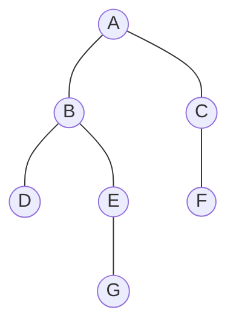
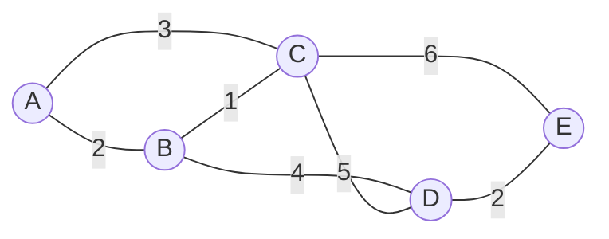
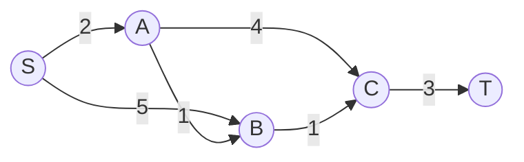
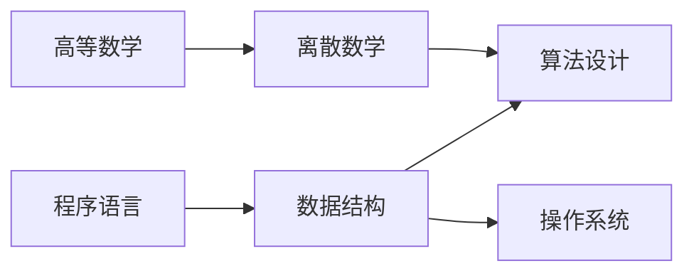
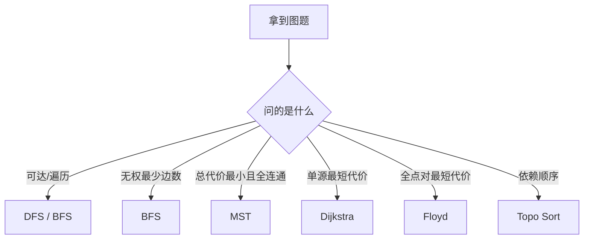

<style>
.slidev-layout {
  background:
    radial-gradient(circle at top left, rgba(196, 76, 53, 0.09), transparent 22%),
    linear-gradient(180deg, #fbf7f0 0%, #f4efe5 100%);
  color: #18222e;
}

h1, h2, h3 {
  letter-spacing: 0.01em;
}

.muted {
  color: #5d6a78;
}

.grid-2,
.grid-3,
.compare {
  display: grid;
  gap: 14px;
}

.grid-2,
.compare {
  grid-template-columns: repeat(2, minmax(0, 1fr));
}

.grid-3 {
  grid-template-columns: repeat(3, minmax(0, 1fr));
}

.card,
.key-point,
.danger,
.steps {
  border: 1px solid rgba(24, 34, 46, 0.12);
  border-radius: 18px;
  padding: 14px 16px;
  background: rgba(255, 250, 241, 0.88);
  box-shadow: 0 12px 28px rgba(24, 34, 46, 0.08);
}

.key-point {
  background: rgba(196, 76, 53, 0.1);
}

.danger {
  background: rgba(142, 51, 34, 0.08);
}

.steps ol,
.steps ul,
.card ul,
.danger ul,
.key-point ul {
  margin: 0.2rem 0 0;
}

.tag {
  display: inline-block;
  padding: 2px 10px;
  border-radius: 999px;
  background: rgba(196, 76, 53, 0.12);
  color: #8e3322;
  font-size: 0.78em;
  font-weight: 700;
}

.tiny {
  font-size: 0.82em;
}

.table-lite table {
  width: 100%;
  border-collapse: collapse;
  font-size: 0.9em;
}

.table-lite th,
.table-lite td {
  border: 1px solid rgba(24, 34, 46, 0.12);
  padding: 8px 10px;
  text-align: left;
}

.table-lite th {
  background: rgba(24, 34, 46, 0.06);
}
</style>

# Lecture 04

## 图算法与综合收束

<div class="muted">从“会画图”推进到“会选算法”</div>

---
layout: section
---

# 开场地图

---

# 四类图题，先问目标

<div class="grid-2">
  <div class="card">
    <div class="tag">Reachability</div>
    <h3>能不能到</h3>
    <div class="muted">DFS / BFS / 连通性</div>
  </div>
  <div class="card">
    <div class="tag">Connection</div>
    <h3>如何最省地连通</h3>
    <div class="muted">Prim / Kruskal / MST</div>
  </div>
  <div class="card">
    <div class="tag">Distance</div>
    <h3>从谁到谁最短</h3>
    <div class="muted">BFS / Dijkstra / Floyd</div>
  </div>
  <div class="card">
    <div class="tag">Order</div>
    <h3>先做什么再做什么</h3>
    <div class="muted">Topo Sort / DAG</div>
  </div>
</div>

<div class="key-point" style="margin-top: 14px;">
图题最怕“算法名很熟，目标却没分清”。
</div>

---

# 图和树，差别在哪

<div class="compare">
  <div class="card">
    <h3>树</h3>
    <ul>
      <li>层次关系</li>
      <li>默认无环</li>
      <li>唯一根路径</li>
    </ul>
  </div>
  <div class="card">
    <h3>图</h3>
    <ul>
      <li>网状关系</li>
      <li>可有环、可有向</li>
      <li>可能有多条路径</li>
    </ul>
  </div>
</div>





---

# 图的建模词典

<div class="grid-3">
  <div class="card">
    <h3>点</h3>
    <div class="muted">对象 / 状态 / 课程 / 城市</div>
  </div>
  <div class="card">
    <h3>边</h3>
    <div class="muted">关系 / 约束 / 可达 / 依赖</div>
  </div>
  <div class="card">
    <h3>权</h3>
    <div class="muted">距离 / 时间 / 费用 / 风险</div>
  </div>
</div>

<div class="steps" style="margin-top: 14px;">
  <ol>
    <li>先分有向 / 无向，带权 / 无权。</li>
    <li>再问稀疏 / 稠密，规模大不大。</li>
    <li>最后才决定存储和算法。</li>
  </ol>
</div>

---

# 邻接矩阵 vs 邻接表

<div class="table-lite">

| 维度 | 邻接矩阵 | 邻接表 |
| --- | --- | --- |
| 空间 | $O(n^2)$ | $O(n+e)$ |
| 判边 $(u,v)$ | 快，$O(1)$ | 看链表，常为 $O(\deg(u))$ |
| 枚举邻居 | 慢，扫一整行 | 快，只看真实边 |
| 适合 | 稠密图 | 稀疏图 |

</div>

<div class="key-point" style="margin-top: 14px;">
考试里常见误区：把“判边快”和“遍历快”混成一件事。
</div>

---

# 选哪种存储

<div class="compare">
  <div class="steps">
    <h3>优先选矩阵</h3>
    <ul>
      <li>顶点数不大</li>
      <li>图较稠密</li>
      <li>频繁查询某条边</li>
    </ul>
  </div>
  <div class="steps">
    <h3>优先选邻接表</h3>
    <ul>
      <li>图较稀疏</li>
      <li>频繁枚举邻接点</li>
      <li>DFS / BFS / Topo 更常见</li>
    </ul>
  </div>
</div>

---
layout: section
---

# 图的搜索与遍历

---

# DFS 与 BFS：像什么

<div class="compare">
  <div class="card">
    <div class="tag">DFS</div>
    <h3>一条路走到底</h3>
    <ul>
      <li>递归 / 栈</li>
      <li>适合回溯、连通块</li>
      <li>更像“深挖”</li>
    </ul>
  </div>
  <div class="card">
    <div class="tag">BFS</div>
    <h3>一层层扩张</h3>
    <ul>
      <li>队列</li>
      <li>适合最少边数问题</li>
      <li>更像“波前”</li>
    </ul>
  </div>
</div>

---

# 手推：同一张图的 DFS / BFS



<div class="grid-2" style="margin-top: 12px;">
  <div class="steps">
    <h3>从 A 出发，邻接点按字母序</h3>
    <div class="muted">DFS: A → B → D → E → G → C → F</div>
  </div>
  <div class="steps">
    <h3>同条件下的 BFS</h3>
    <div class="muted">BFS: A → B → C → D → E → F → G</div>
  </div>
</div>

---

# BFS 为什么能求无权最短路

<div class="grid-2">
  <div class="card">
    <h3>关键事实</h3>
    <ul>
      <li>队列按层推进</li>
      <li>先到的一定边数更少</li>
      <li>第一次出队即可定层数</li>
    </ul>
  </div>
  <div class="danger">
    <h3>但它不能处理</h3>
    <ul>
      <li>边权不等</li>
      <li>负权最短路</li>
      <li>“总代价最小”的一般问题</li>
    </ul>
  </div>
</div>

---

# 代码模板：邻接表 + BFS

```python
from collections import deque

def bfs(graph, start):
    dist = {start: 0}
    q = deque([start])

    while q:
        u = q.popleft()
        for v in graph[u]:
            if v in dist:
                continue
            dist[v] = dist[u] + 1
            q.append(v)
    return dist
```

<div class="muted tiny">考试里最常丢分的不是主体逻辑，而是 visited 标记时机。</div>

---

# 遍历常见错误

<div class="grid-3">
  <div class="danger">
    <h3>错误 1</h3>
    <div class="muted">出队后才标记，导致重复入队</div>
  </div>
  <div class="danger">
    <h3>错误 2</h3>
    <div class="muted">默认图连通，漏掉外层循环</div>
  </div>
  <div class="danger">
    <h3>错误 3</h3>
    <div class="muted">把 DFS 次序当唯一答案</div>
  </div>
</div>

<div class="key-point" style="margin-top: 14px;">
遍历序列常与“邻接点访问顺序”绑定，题目没说就别擅自唯一化。
</div>

---
layout: section
---

# 最小生成树

---

# MST 在求什么

<div class="compare">
  <div class="card">
    <h3>目标</h3>
    <div class="muted">用最小总代价把所有点连起来</div>
  </div>
  <div class="card">
    <h3>限制</h3>
    <div class="muted">无向、连通、选 n-1 条边、不成环</div>
  </div>
</div>

<div class="danger" style="margin-top: 14px;">
MST 不是“从某个源点到其他点都最短”。
</div>

---

# Prim：从一个连通块向外长



<div class="steps" style="margin-top: 12px;">
  <ol>
    <li>从 A 开始，当前树 = {A}</li>
    <li>选跨割最小边 A-B(2)</li>
    <li>再选 B-C(1)</li>
    <li>再选 B-D(4)</li>
    <li>再选 D-E(2)</li>
  </ol>
</div>

<div class="muted tiny">思维像“每次给当前连通块接一根最便宜的线”。</div>

---

# Kruskal：按边从小到大捡

<div class="table-lite">

| 边 | 权 | 结果 |
| --- | --- | --- |
| B-C | 1 | 选 |
| A-B | 2 | 选 |
| D-E | 2 | 选 |
| A-C | 3 | 弃，成环 |
| B-D | 4 | 选 |

</div>

<div class="key-point" style="margin-top: 14px;">
核心不是“排序”本身，而是“用并查集判环”。
</div>

---

# Prim vs Kruskal

<div class="table-lite">

| 角度 | Prim | Kruskal |
| --- | --- | --- |
| 出发点 | 一个连通块 | 全局最小边 |
| 关注对象 | 点集扩张 | 边集筛选 |
| 常见实现 | 邻接表 + 堆 | 排序 + 并查集 |
| 更顺手的图 | 稠密图 | 稀疏图 |

</div>

---
layout: section
---

# 最短路径

---

# 最短路题先分三类

<div class="grid-3">
  <div class="card">
    <h3>无权</h3>
    <div class="muted">BFS</div>
  </div>
  <div class="card">
    <h3>单源带权非负</h3>
    <div class="muted">Dijkstra</div>
  </div>
  <div class="card">
    <h3>所有点对</h3>
    <div class="muted">Floyd</div>
  </div>
</div>

<div class="danger" style="margin-top: 14px;">
不要把“最短路径树”误认为“最小生成树”。
</div>

---

# Dijkstra 手推快照



<div class="steps" style="margin-top: 12px;">
  <ol>
    <li>初始化：dist[S]=0，其余为 ∞</li>
    <li>确定 S，松弛得到 A=2，B=5</li>
    <li>确定 A，更新 B=3，C=6</li>
    <li>确定 B，更新 C=4</li>
    <li>确定 C，更新 T=7</li>
  </ol>
</div>

---

# Floyd：多源最短路的统一视角

<div class="compare">
  <div class="card">
    <h3>状态含义</h3>
    <div class="muted">dist[i][j]：当前已允许部分中转点时的最短路</div>
  </div>
  <div class="card">
    <h3>转移</h3>
    <div class="muted">dist[i][j] = min(dist[i][j], dist[i][k] + dist[k][j])</div>
  </div>
</div>

<div class="steps" style="margin-top: 14px;">
  <ol>
    <li>枚举中转点 k</li>
    <li>尝试让 i → k → j 更短</li>
    <li>适合点数不大、需要全源答案</li>
  </ol>
</div>

---

# 最短路代码骨架：Dijkstra

```python
import heapq

def dijkstra(graph, start):
    dist = {v: float("inf") for v in graph}
    dist[start] = 0
    pq = [(0, start)]

    while pq:
        d, u = heapq.heappop(pq)
        if d != dist[u]:
            continue
        for v, w in graph[u]:
            nd = d + w
            if nd < dist[v]:
                dist[v] = nd
                heapq.heappush(pq, (nd, v))
    return dist
```

---
layout: section
---

# DAG 与拓扑排序

---

# 拓扑排序：先修关系的线性化



<div class="grid-2" style="margin-top: 12px;">
  <div class="steps">
    <h3>算法动作</h3>
    <ul>
      <li>找入度为 0 的点</li>
      <li>输出并删边</li>
      <li>重复直到结束</li>
    </ul>
  </div>
  <div class="danger">
    <h3>如果找不到入度 0</h3>
    <div class="muted">说明图里有环，不存在拓扑序</div>
  </div>
</div>

---

# 四类图算法，怎么区分

<div class="table-lite">

| 问题 | 目标 | 典型算法 |
| --- | --- | --- |
| 遍历 | 找到所有可达点 | DFS / BFS |
| 连通最省 | 连通全部点，总代价最小 | Prim / Kruskal |
| 路径最短 | 两点或多点最短代价 | BFS / Dijkstra / Floyd |
| 先后顺序 | 满足依赖关系 | Topo Sort |

</div>

---
layout: section
---

# 典型例题

---

# 例 1：建模先于算法

<div class="card">
校园课程先修关系、任务调度、编译流程，应该建成什么图？
</div>

<div class="steps" style="margin-top: 14px;">
  <ol>
    <li>对象是课程 / 任务 → 顶点</li>
    <li>“先修于”是方向关系 → 有向边</li>
    <li>若只问可行顺序 → DAG + 拓扑排序</li>
  </ol>
</div>

---

# 例 2：MST 还是最短路

<div class="compare">
  <div class="card">
    <h3>铺设校园光纤</h3>
    <div class="muted">希望全部楼宇连通，总成本最低</div>
    <div class="tag" style="margin-top: 8px;">MST</div>
  </div>
  <div class="card">
    <h3>从宿舍到机房导航</h3>
    <div class="muted">只关心某起点到某终点最短</div>
    <div class="tag" style="margin-top: 8px;">Shortest Path</div>
  </div>
</div>

---

# 例 3：综合辨析

<div class="grid-3">
  <div class="card">
    <h3>无权迷宫</h3>
    <div class="muted">BFS</div>
  </div>
  <div class="card">
    <h3>城市路网导航</h3>
    <div class="muted">Dijkstra</div>
  </div>
  <div class="card">
    <h3>课程安排</h3>
    <div class="muted">Topo Sort</div>
  </div>
</div>

<div class="key-point" style="margin-top: 14px;">
题型识别的第一步，不是回忆代码，而是读出“目标函数”。
</div>

---
layout: section
---

# 课堂练习

---

# 练习 A：手推遍历

<div class="card">
给定一张无向图，邻接点按编号从小到大访问。写出从 1 出发的 DFS、BFS。
</div>

<div class="muted" style="margin-top: 12px;">
检查点：visited 标记时机、同层扩展顺序、是否会重复访问。
</div>

---

# 练习 B：算法配对

<div class="table-lite">

| 场景 | 你选什么 |
| --- | --- |
| 稀疏图，要求全点对最短路 |  |
| 铺网线，代价总和最小 |  |
| 课程有先修关系 |  |
| 无权图求最少经过边数 |  |

</div>

---

# 练习 C：找错题

<div class="danger">
某同学说：“Dijkstra 求出的是一棵边权和最小的树，所以和 Prim 本质一样。”
</div>

<div class="steps" style="margin-top: 14px;">
  <ol>
    <li>指出错在“目标不同”</li>
    <li>举一个反例说明</li>
    <li>补一句：最短路树依赖源点</li>
  </ol>
</div>

---
layout: section
---

# 课后题

---

# 建议题单

<div class="steps">
  <ol>
    <li>一题邻接矩阵 / 邻接表复杂度比较</li>
    <li>一题 DFS / BFS 手推</li>
    <li>一题 Prim 或 Kruskal 执行过程</li>
    <li>一题 Dijkstra 或 Floyd 状态更新</li>
    <li>一题拓扑排序与判环</li>
  </ol>
</div>

---

# 本讲收束：图题决策树



---

# 前四讲的总地图

<div class="grid-2">
  <div class="card">
    <h3>线性结构</h3>
    <div class="muted">顺序表、链表、串、栈、队列</div>
  </div>
  <div class="card">
    <h3>非线性结构</h3>
    <div class="muted">树、检索结构、图</div>
  </div>
  <div class="card">
    <h3>算法关注点</h3>
    <div class="muted">复杂度、过程、适用场景、易错点</div>
  </div>
  <div class="card">
    <h3>下一步</h3>
    <div class="muted">上机复习：模板、边界、调试</div>
  </div>
</div>

---

# 最后一页清单

<div class="steps">
  <ol>
    <li>分清遍历、最短路、MST、拓扑排序。</li>
    <li>会看图、会手推、会说出为什么选它。</li>
    <li>代码层面重点盯住 visited、堆、判环、入度。</li>
  </ol>
</div>

<div class="key-point" style="margin-top: 16px;">
图算法真正的门槛不是公式，而是“建模 + 目标识别”。
</div>
